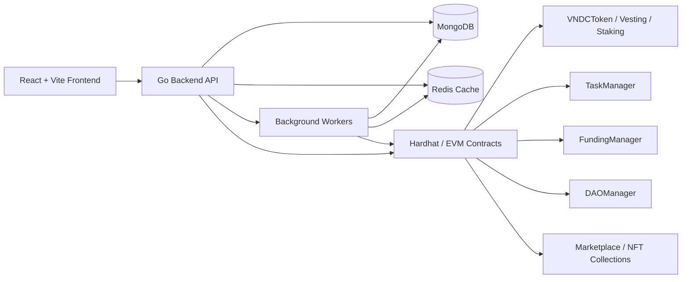

# VNDC Platform

VNDC là một nền tảng Web3 full-stack được thiết kế như một hệ sinh thái vận hành số hoàn chỉnh, kết nối token economy, nhận diện người dùng, hoạt động học tập, gây quỹ cộng đồng, quản trị DAO, marketplace NFT, ticketing và analytics quản trị trên cùng một kiến trúc thống nhất.

Tài liệu này đóng vai trò như portfolio kỹ thuật cấp dự án: mô tả mục tiêu sản phẩm, bài toán hệ thống, kiến trúc tổng thể, năng lực nghiệp vụ, lựa chọn công nghệ và các đặc điểm thể hiện tư duy production-ready của hệ thống.

## 1. Executive Summary

VNDC không chỉ là một token app hay một smart contract demo. Đây là một monorepo Web3 platform gồm 3 lớp chính:

- On-chain contracts để hiện thực hóa token, vesting, staking, DAO, task rewards, fundraising và NFT marketplace.
- Off-chain backend viết bằng Go để xử lý authentication, nghiệp vụ ứng dụng, persistence, audit, caching, worker orchestration và API exposure.
- Frontend React + Vite + TypeScript để cung cấp trải nghiệm người dùng cho ví, giao dịch, governance, fundraising, learning, marketplace và admin operations.

Mục tiêu của dự án là xây dựng một digital economy platform nơi token không tồn tại tách rời, mà được gắn trực tiếp vào hành vi người dùng, hoạt động học tập, thành tích, đóng góp cộng đồng, thương mại tài sản số và governance.

## 2. Product Vision

VNDC được định hình như một nền tảng quản trị và vận hành tài sản số có thể dùng trong môi trường học thuật, cộng đồng, tổ chức hoặc hệ sinh thái số nội bộ. Thay vì chỉ hỗ trợ chuyển token, hệ thống mở rộng token thành một lớp incentive và settlement layer cho nhiều domain business khác nhau:

- Wallet-based identity và SIWE authentication.
- Token transfer có relayer, deadline, nonce và replay protection.
- Reward engine cho học tập, hoạt động và task completion.
- Fundraising với ledger, deputy management và settlement reconciliation.
- DAO governance với proposal lifecycle, vote power và execution.
- NFT marketplace và social-commerce style order flows.
- Event ticketing và service ticketing kèm QR verification.
- Admin dashboard, monitoring metrics và moderation workflows.

## 3. Core Business Domains

### 3.1 Identity and Access

Hệ thống sử dụng mô hình xác thực theo ví Ethereum thay vì username/password truyền thống. Người dùng đăng nhập bằng SIWE/EIP-191, sau đó backend phát hành JWT access/refresh tokens. Các capability liên quan gồm:

- Nonce-based challenge để chống replay.
- Session lifecycle với refresh token rotation.
- Redis blacklist cho access token logout sớm.
- TOTP 2FA và backup codes.
- Role-based access control cho admin, operator và người dùng thường.
- KYC levels cho các route cần kiểm soát định danh mạnh hơn.

### 3.2 Token Economy

Lớp token là trục thanh toán và incentive chính của toàn nền tảng. Hệ thống hỗ trợ:

- Public balance lookup.
- Signed transfer queueing.
- Batch settlement qua relayer worker.
- Nonce validation và pending amount calculation.
- Minting, pause/unpause, vesting và release vested tokens.
- Balance cache để giảm chi phí đọc trạng thái lặp lại.

### 3.3 Learning, Activity, Task and Reward

VNDC tích hợp token economy vào hành vi người dùng. Các module task/activity được xây để gắn reward với participation thật:

- Learning sessions với heartbeat và expiry logic.
- Proof code, task claims và student progress tracking.
- Activity creation, enrollment, evaluation, leaderboard.
- Reward queue và reward settlement workers.
- TaskManager contract làm treasury pool cho các claim/reward flows.

### 3.4 Fundraising and Community Finance

Platform hỗ trợ fundraising ở cả mức off-chain ledger lẫn on-chain contract coordination:

- Activity-based fundraising records.
- Contribution, expense và summary views.
- Pot provisioning on-chain.
- Contribution settlement finalization và failure compensation.
- Campaign resolution worker cho flows thành công hoặc refund.

### 3.5 DAO Governance

DAO là domain cho governance và vote orchestration:

- DAO creation và founder-controlled state changes.
- Proposal creation, voting, queueing, execution, cancellation.
- Vote power derivation từ token balance và NFT boost.
- Worker tự động resolve proposal hết hạn và execute proposal đã qua timelock.

### 3.6 Marketplace and Ticketing

Hệ thống bao phủ cả commerce cho tài sản số lẫn ticket/service products:

- NFT listing, mint-and-list, listing cancellation, finalize sale.
- Physical/off-chain product style order states.
- Service ticket products, stock reservation, verification và scan log.
- Event tickets với encrypted QR payload và check-in validation.

## 4. Why This Project Is More Than a Demo

Điểm mạnh của VNDC nằm ở chỗ các module không đứng riêng lẻ. Nhiều flow được nối với nhau theo kiểu production system:

- Một signed transfer có thể được tạo từ token module, fundraising module, marketplace payment hoặc campaign refund.
- Reward payout không chỉ ghi transaction mà còn cập nhật activity records, claim state và user activity points.
- Worker layer đóng vai trò operational backbone, thay vì để HTTP request xử lý toàn bộ asynchronous reconciliation.
- MongoDB, Redis và blockchain adapter được điều phối thống nhất qua các service và repository ports.

Điều này làm dự án tiến gần một production platform thực tế hơn nhiều so với một tập hợp smart contract độc lập.

## 5. System Architecture



### 5.1 Architectural Style

Off-chain backend đi theo tinh thần hexagonal architecture / clean layering:

- `internal/application`: service layer, handler layer, use-case orchestration.
- `internal/ports`: interface contracts giữa application và infrastructure.
- `internal/adapters`: MongoDB, cache và blockchain-facing adapters.
- `internal/domain`: domain entities và state models.
- `internal/workers`: async background processing.

Kiến trúc này giúp logic nghiệp vụ không bị khóa cứng vào MongoDB hay blockchain SDK, từ đó dễ test hơn, dễ mở rộng hơn và rõ ranh giới trách nhiệm hơn.

### 5.2 Monorepo Structure

```text
VNDC/
├── Frontend/Web/react-vite-ts/     # React + TypeScript client app
├── offchain/backend-go/            # Go API, services, workers, adapters
├── offchain/backend-mongodb/       # MongoDB schemas, migrations, setup helpers
├── onchain/                        # Hardhat contracts, scripts, artifacts
├── Frontend-UI-Demo/               # UI demo/reference HTML assets
├── docker-compose.yml              # Local infra orchestration
└── RUN.md                          # Local runbook
```

## 6. Technical Stack

### Frontend

- React 19
- TypeScript 6
- Vite 8
- Ant Design 6
- Tailwind CSS 4
- Ethers v6
- React Router 7

### Off-chain Backend

- Go 1.22
- Gin HTTP framework
- MongoDB driver
- Redis v9 client
- JWT v5
- Viper configuration
- Zap-based logging abstraction
- Swag / Swagger integration

### On-chain Layer

- Solidity via Hardhat
- Ethers v6
- TypeChain
- OpenZeppelin Contracts

### Infrastructure

- MongoDB with replica set support for Change Streams
- Redis for cache / token blacklist / fast state operations
- Hardhat local chain for development and integration testing
- Docker Compose cho local orchestration

## 7. Production-Oriented Engineering Characteristics

### 7.1 Asynchronous Processing and Operational Safety

VNDC không xử lý mọi thứ inline trong request-response cycle. Hệ thống có các worker nền cho các loại việc cần eventual consistency hoặc delayed reconciliation:

- BatchWorker cho pending transaction settlement.
- TokenTransferWorker dùng Change Streams hoặc polling fallback để trigger batch processing.
- SessionWorker cho expiring hanging learning sessions.
- RewardProcessingWorker và RewardSettlementWorker cho reward pipeline.
- ClaimWorker cho approved task-claim settlement.
- DAOWorker và CampaignWorker cho lifecycle automation.

Thiết kế này giúp request layer gọn hơn, giảm độ trễ perceived của user, đồng thời cho phép ghi nhận lỗi vận hành và retry một cách có kiểm soát.

### 7.2 Graceful Degradation

Một điểm rất thực tế trong hệ thống là khả năng chạy được cả khi môi trường local không hoàn hảo. Ví dụ:

- TokenTransferWorker có thể dùng Mongo Change Streams khi Mongo chạy replica set.
- Nếu không có Change Streams, worker fallback sang interval polling thay vì fail cứng.

Đây là chi tiết nhỏ nhưng rất quan trọng với một codebase production-minded: hệ thống không giả định môi trường luôn hoàn hảo.

### 7.3 Security Controls

Các control chính đã hiện diện trong kiến trúc:

- Wallet signature verification.
- Nonce uniqueness và deadline checks.
- JWT authentication với refresh rotation.
- 2FA và backup codes.
- Role + KYC enforced routes.
- Access token blacklist.
- Audit log persistence.
- Rate limiting support.
- Pending balance reservation để tránh overspending trước settlement.

### 7.4 Observability and Operational Design

Hệ thống đã có nhiều yếu tố giúp vận hành dễ hơn:

- Module-scoped loggers.
- Health/ready endpoints.
- Paginated admin queues.
- Status-based processing models.
- Structured update paths cho queued, processing, success, failed, cancelled.
- Dockerized local dependencies.

### 7.5 Domain Separation With Shared Settlement Layer

Một đặc điểm kiến trúc tốt của VNDC là nhiều business domain dùng chung transaction and settlement primitives. Điều này giúp:

- Giảm duplication trong xử lý thanh toán.
- Chuẩn hóa status lifecycle.
- Tái sử dụng batch settlement cho nhiều module.
- Dễ mở rộng thêm domain mới dựa trên cùng payment substrate.

## 8. Representative User Flows

### 8.1 Wallet Login Flow

1. Frontend yêu cầu challenge cho một wallet.
2. Backend sinh nonce và SIWE message.
3. User ký message bằng ví.
4. Backend verify signature.
5. Nếu bật 2FA thì yêu cầu bước TOTP tiếp theo.
6. Session được tạo và JWT pair được phát hành.

### 8.2 Signed Transfer Flow

1. Client lấy nonce hiện tại.
2. Client tạo typed-data payload và ký bằng ví.
3. Backend validate signature, deadline, nonce và balance reservation.
4. Transaction được queue ở trạng thái pending.
5. BatchWorker gom nhiều transaction và submit on-chain.
6. Side effects sau settlement được reconcile vào các module liên quan.

### 8.3 Reward Claim Flow

1. Activity/task tạo reward intent hoặc approved claim.
2. Reward/Claim worker đọc queue.
3. Worker kiểm tra task-manager pool balance.
4. ClaimReward được submit on-chain.
5. Transaction history, processed reward, activity record và user points được cập nhật.

### 8.4 Fundraising and Marketplace Settlement

1. User tạo contribution hoặc purchase off-chain.
2. Payment transfer được queue dưới dạng transaction.
3. Batch settlement thực hiện on-chain.
4. Worker hậu xử lý finalize contribution, finalize NFT sale, hoặc cập nhật order/ticket stock tùy context type.

## 9. Local Development and Environment

### 9.1 Local Services

Môi trường local của dự án xoay quanh các thành phần sau:

- Backend Go tại `http://127.0.0.1:8080`
- Frontend Vite tại `http://localhost:5173`
- Hardhat local chain tại `http://127.0.0.1:8545`
- MongoDB tại `mongodb://localhost:27017`
- Redis tại `localhost:6379`

### 9.2 Docker Compose Support

File `docker-compose.yml` cho thấy dự án đã được chuẩn bị để khởi động local infra theo kiểu service-based:

- MongoDB replica set để hỗ trợ Change Streams.
- Redis cache.
- Hardhat node.
- Backend container.
- Mongo Express và Redis Commander cho thao tác vận hành nội bộ.

### 9.3 Runbook

Hướng dẫn chạy chi tiết được lưu trong `RUN.md`.

Các command chính:

```powershell
cd "d:\Blockchain\VNDC\onchain" ; npm install
cd "d:\Blockchain\VNDC\Frontend\Web\react-vite-ts" ; npm install
cd "d:\Blockchain\VNDC\offchain\backend-go" ; go mod download
```

Khởi động môi trường local theo thứ tự:

```powershell
cd "d:\Blockchain\VNDC\onchain" ; npm run node
cd "d:\Blockchain\VNDC\offchain\backend-go" ; go run ./cmd/server
cd "d:\Blockchain\VNDC\Frontend\Web\react-vite-ts" ; npm run dev
```

## 10. Repository Highlights

### 10.1 Frontend

Frontend đóng vai trò product layer, không chỉ là demo page. Codebase có đủ nền tảng để hiển thị:

- wallet and balance flows
- token transfer UX
- DAO interaction views
- marketplace and fundraising screens
- QR / ticket related interactions
- admin-friendly data displays

### 10.2 Backend

Backend là phần có chiều sâu kiến trúc lớn nhất của dự án. Nó xử lý:

- API transport
- business validation
- Mongo persistence
- Redis cache and blacklist
- blockchain adapter calls
- background job orchestration
- role / KYC / audit boundaries

### 10.3 Smart Contracts

Lớp on-chain không chỉ có token contract mà là một suite contract tương đối đầy đủ:

- `VNDCToken`
- `VNDCStaking`
- `VNDCTokenVesting`
- `TaskManager`
- `FundingManager`
- `DAOManager`
- `MarketplaceManager`
- `VNDCNFTCollection`
- `VNDCErc721Collection`
- `NFTMarketplace721`

Điều này phản ánh scope dự án ở mức platform, không phải chỉ một use case blockchain đơn lẻ.

## 11. Strengths From a Portfolio Perspective

Nếu nhìn dưới góc độ portfolio kỹ sư hoặc team product-engineering, VNDC thể hiện rõ nhiều năng lực quan trọng:

- Thiết kế hệ thống đa lớp giữa frontend, backend, database, cache và blockchain.
- Điều phối nhiều domain business trong cùng một payment and identity model.
- Tư duy backend production với worker, queue-like flows, status transitions và compensation logic.
- Khả năng xây smart contracts đi kèm adapter và service layer thực tế.
- Khả năng phát triển full-stack thay vì chỉ mạnh ở một phía frontend hoặc blockchain.
- Tư duy vận hành local environment bài bản với runbook, docker compose và health checks.

## 12. Current State

Ở trạng thái hiện tại, codebase đã thể hiện một nền tảng có scope rộng, chiều sâu backend tốt và mô hình domain tương đối chặt chẽ. Đây là một base rất phù hợp cho:

- production hardening thêm
- CI/CD và deployment environment separation
- observability nâng cao
- automated test coverage sâu hơn theo từng module
- cloud infrastructure rollout

## 13. Recommended Next Evolution Toward Full Production

Nếu phát triển tiếp lên môi trường production thật, các hướng đi có giá trị nhất sẽ là:

1. Bổ sung CI pipeline cho contract tests, Go tests, frontend build và lint.
2. Chuẩn hóa environment config cho dev, staging, production.
3. Tăng cường integration tests cho multi-module settlement flows.
4. Thêm tracing, metrics dashboards và alerting cho worker pipelines.
5. Hoàn thiện deployment scripts và secret management.
6. Bổ sung data retention, backup và operational runbooks cho production incidents.

## 14. Conclusion

VNDC là một dự án có giá trị portfolio cao vì nó cho thấy khả năng xây dựng một Web3 platform thực chiến theo tư duy hệ thống hoàn chỉnh: có business domains rõ ràng, backend orchestration sâu, smart contract suite đủ rộng, UI layer hiện đại và các chi tiết vận hành gần với thực tế production.

Nói ngắn gọn, đây là một full-stack blockchain platform với kiến trúc đủ lớn để chứng minh năng lực thiết kế, triển khai và điều phối sản phẩm số phức hợp ở mức chuyên nghiệp.
