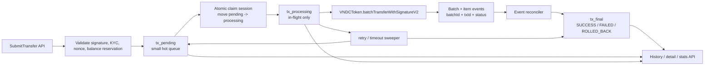
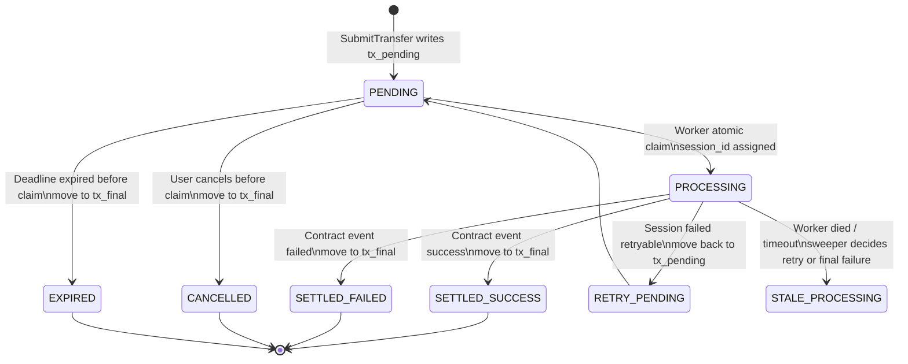
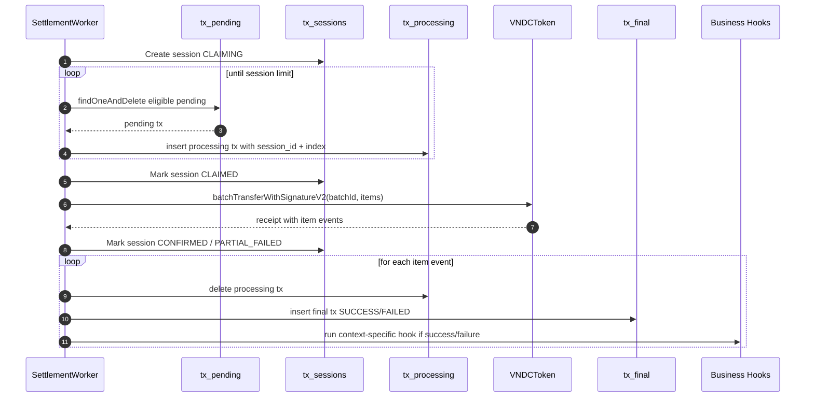
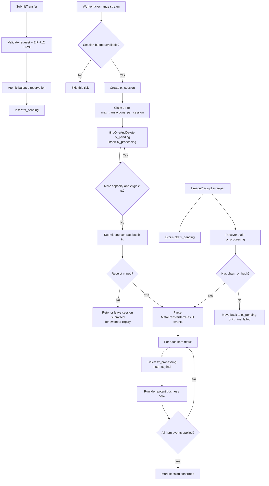

# FLAN Refactor Workbook: Transaction Queue, Batch Settlement, and Event Reconciliation

This workbook designs the refactor before touching source code. It is written for the current VNDC structure:

- Off-chain backend: `offchain/backend-go`
- Token contract: `onchain/contracts/VNDCToken.sol`
- Current transaction API: `internal/application/transaction`
- Current worker: `internal/workers/batch_worker.go`, `internal/workers/token_transfer_worker.go`
- Current Mongo adapter: `internal/adapters/mongodb/repos.go`
- Current token adapter: `pkg/blockchain/token_contract.go`

## 0. FLAN Definition

For this refactor, use FLAN as the implementation workbook rhythm:

- **F - Frame**: define target architecture, invariants, collections, states, and constraints.
- **L - Locate**: map every existing module that must change.
- **A - Adapt**: design new contracts, repository ports, workers, endpoint behavior, and migration flow.
- **N - Normalize**: define validation, idempotency, observability, rollback, and test gates.

The refactor goal is not only faster queries. The end state must also be safer under scale, cheaper on-chain, and easier to reconcile deterministically.

## 1. Target Problems

Current implementation has these structural issues:

1. One large `transactions` collection stores all statuses.
2. Worker scans by status inside that collection.
3. Multiple app instances can claim the same pending transaction.
4. Batch worker is an off-chain batch only; Go adapter currently sends one Ethereum transaction per transfer.
5. Contract event `SubTransactionResponse(index, success, reason)` is not enough to map each result to an off-chain transaction ID.
6. Endpoint reads and lists depend on one collection, so moving state into multiple collections requires a query facade.
7. There is no explicit "settlement session" with per-session execution limits, budget limits, or concurrency ownership.

## 2. Target Architecture



### Collection Strategy

Use collections by lifecycle state:

- `tx_pending`: small, hot queue. Only transactions ready to be claimed by workers.
- `tx_processing`: in-flight transactions already claimed into a settlement session.
- `tx_final`: immutable-ish transaction history for terminal states.
- `tx_sessions`: settlement session metadata, limits, ownership, on-chain hash, counters.
- `tx_events`: optional idempotent event log from chain receipts or event listener.

Keep `batches` only if still useful for compatibility. Prefer replacing it with `tx_sessions`.

## 3. State Model



### Canonical Status Names

Use these status values consistently across domain, DB, API, and tests:

- `PENDING`
- `PROCESSING`
- `SUCCESS`
- `FAILED`
- `CANCELLED`
- `EXPIRED`

Avoid ambiguous values like `QUEUED`, `BATCHED`, `ROLLED_BACK` unless they are explicitly required. If backward compatibility is needed, expose old names in API as aliases only.

## 4. Data Model Workbook

### 4.1 `tx_pending`

Purpose: the only collection workers scan for new work.

Recommended fields:

```json
{
  "_id": "uuid",
  "tx_id": "uuid-or-same-as-_id",
  "type": "TOKEN_TRANSFER",
  "status": "PENDING",
  "from_wallet": "0x...",
  "to_wallet": "0x...",
  "amount": "1000000000000000000",
  "nonce": "42",
  "deadline": 1760000000,
  "signature": "0x...",
  "context_type": "marketplace",
  "context_id": "purchase-id",
  "context_ref": "external-ref",
  "idempotency_key": "wallet:nonce:type-or-client-key",
  "priority": 0,
  "retry_count": 0,
  "not_before": "date",
  "created_at": "date",
  "updated_at": "date"
}
```

Indexes:

```js
db.tx_pending.createIndex({ not_before: 1, priority: -1, created_at: 1 })
db.tx_pending.createIndex({ from_wallet: 1, nonce: 1 }, { unique: true })
db.tx_pending.createIndex({ idempotency_key: 1 }, { unique: true, sparse: true })
db.tx_pending.createIndex({ deadline: 1 })
db.tx_pending.createIndex({ context_type: 1, context_id: 1 })
```

Notes:

- `tx_pending` should remain small because claimed items move out immediately.
- `not_before` supports delayed retry without scanning final history.
- Unique `(from_wallet, nonce)` prevents duplicate active submissions.

### 4.2 `tx_processing`

Purpose: transactions claimed by one settlement session but not terminal yet.

Recommended fields:

```json
{
  "_id": "uuid",
  "tx_id": "uuid",
  "session_id": "session-uuid",
  "session_index": 0,
  "status": "PROCESSING",
  "claim_owner": "worker-instance-id",
  "claimed_at": "date",
  "claim_expires_at": "date",
  "chain_batch_id": "bytes32 hex",
  "chain_tx_hash": "0x...",
  "last_error": "",
  "payload": {
    "type": "TOKEN_TRANSFER",
    "from_wallet": "0x...",
    "to_wallet": "0x...",
    "amount": "1000",
    "nonce": "42",
    "deadline": 1760000000,
    "signature": "0x...",
    "context_type": "",
    "context_id": "",
    "context_ref": ""
  },
  "created_at": "date",
  "updated_at": "date"
}
```

Indexes:

```js
db.tx_processing.createIndex({ session_id: 1, session_index: 1 }, { unique: true })
db.tx_processing.createIndex({ claim_expires_at: 1 })
db.tx_processing.createIndex({ chain_batch_id: 1 })
db.tx_processing.createIndex({ tx_id: 1 }, { unique: true })
db.tx_processing.createIndex({ claim_owner: 1, claimed_at: 1 })
```

Notes:

- `payload` keeps the originally signed data frozen during processing.
- `session_index` must match the item index submitted to the contract.
- `chain_batch_id` should be included in contract events.

### 4.3 `tx_final`

Purpose: terminal history. It can grow large without slowing the hot queue.

Recommended fields:

```json
{
  "_id": "uuid",
  "tx_id": "uuid",
  "type": "TOKEN_TRANSFER",
  "status": "SUCCESS",
  "from_wallet": "0x...",
  "to_wallet": "0x...",
  "amount": "1000",
  "nonce": "42",
  "deadline": 1760000000,
  "signature_hash": "0xhash-only-or-full-signature-if-needed",
  "context_type": "",
  "context_id": "",
  "context_ref": "",
  "session_id": "session-uuid",
  "chain_batch_id": "0xbytes32",
  "session_index": 0,
  "tx_hash": "0x...",
  "block_number": 123,
  "gas_used": 100000,
  "settled_at": "date",
  "failed_reason": "",
  "retry_count": 0,
  "created_at": "date",
  "updated_at": "date"
}
```

Indexes:

```js
db.tx_final.createIndex({ tx_id: 1 }, { unique: true })
db.tx_final.createIndex({ from_wallet: 1, created_at: -1 })
db.tx_final.createIndex({ to_wallet: 1, created_at: -1 })
db.tx_final.createIndex({ status: 1, created_at: -1 })
db.tx_final.createIndex({ session_id: 1 })
db.tx_final.createIndex({ chain_batch_id: 1, session_index: 1 })
db.tx_final.createIndex({ context_type: 1, context_id: 1 })
```

Notes:

- For privacy and document size, consider storing `signature_hash` instead of full signature in final history.
- If audit requires full signature, keep it but exclude it from common API projections.

### 4.4 `tx_sessions`

Purpose: one worker settlement attempt with execution limits.

Recommended fields:

```json
{
  "_id": "session-uuid",
  "status": "CLAIMED",
  "owner": "worker-instance-id",
  "chain_batch_id": "0xbytes32",
  "chain_tx_hash": "0x...",
  "max_items": 50,
  "claimed_count": 50,
  "success_count": 0,
  "failed_count": 0,
  "unknown_count": 50,
  "gas_limit": 8000000,
  "max_gas_price_wei": "100000000000",
  "started_at": "date",
  "submitted_at": "date",
  "confirmed_at": "date",
  "expires_at": "date",
  "last_error": "",
  "created_at": "date",
  "updated_at": "date"
}
```

Indexes:

```js
db.tx_sessions.createIndex({ status: 1, created_at: -1 })
db.tx_sessions.createIndex({ owner: 1, status: 1 })
db.tx_sessions.createIndex({ chain_batch_id: 1 }, { unique: true, sparse: true })
db.tx_sessions.createIndex({ expires_at: 1 })
```

Session status values:

- `CLAIMED`
- `SUBMITTED`
- `CONFIRMED`
- `PARTIAL_FAILED`
- `FAILED`
- `TIMED_OUT`

## 5. Worker Claiming Logic

### 5.1 Session Limits

Add config:

```yaml
worker:
  settlement:
    enabled: true
    max_sessions_per_tick: 1
    max_transactions_per_session: 50
    max_transactions_per_minute: 300
    max_gas_per_session: 8000000
    claim_ttl: "2m"
    submit_timeout: "90s"
    confirmation_timeout: "5m"
    retry_max: 3
    retry_delay: "30s"
    worker_instance_id: "" # generated at boot if empty
```

Meaning:

- `max_transactions_per_session`: hard cap for one contract batch call.
- `max_transactions_per_minute`: global throttle per worker process. If multiple replicas run workers, use distributed rate limit or run one worker service.
- `max_sessions_per_tick`: prevents one tick from draining the whole queue and causing gas/RPC spikes.
- `claim_ttl`: if worker dies, a sweeper can recover stuck processing docs.

### 5.2 Atomic Claim Algorithm

Do not read pending items and then update them later. Claim must be atomic.

Recommended Mongo pattern:

1. Create session document with status `CLAIMING`.
2. Repeatedly claim one pending document using `findOneAndDelete` sorted by priority/created time.
3. Insert claimed doc into `tx_processing` with `session_id`, `session_index`, owner, expiry.
4. Stop when limit reached, no pending docs remain, or budget limiter says stop.
5. Set session status `CLAIMED`.

Pseudo-code:

```go
func ClaimSession(ctx, limit int) (*Session, []ProcessingTx, error) {
    session := createSession(status=CLAIMING)

    for i := 0; i < limit; i++ {
        pending := txPending.FindOneAndDelete(
            filter: { not_before <= now, deadline > now },
            sort: { priority: -1, created_at: 1 },
        )
        if pending == nil {
            break
        }

        processing := pending.ToProcessing(session.ID, i, owner, claimTTL)
        txProcessing.InsertOne(processing)
    }

    if claimed == 0 {
        deleteSession(session.ID)
        return nil, nil, ErrNoWork
    }

    markSessionClaimed(session.ID, claimed)
    return session, processingTxs, nil
}
```

Why `findOneAndDelete`:

- Removes each item from the hot queue immediately.
- Avoids duplicate claims without multi-document locking.
- Keeps `tx_pending` small and fast.

If Mongo replica set is available, wrap claim moves in a transaction. If not, design idempotent recovery:

- If delete succeeds and insert processing fails, write a repair log and requeue.
- Prefer replica set for production.

## 6. Contract Refactor Workbook

Current `VNDCToken.sol` already has `batchTransferWithSignature`, but it needs stronger event correlation and a safer item result model.

### 6.1 New Solidity Types

Recommended struct:

```solidity
struct SignedTransfer {
    bytes32 txId;
    address from;
    address to;
    uint256 amount;
    uint256 nonce;
    uint256 deadline;
    bytes signature;
}
```

`txId` is the off-chain transaction ID converted to `bytes32`, or `keccak256(bytes(tx_id))` if UUID string is kept off-chain.

### 6.2 New Events

```solidity
event MetaTransferBatchStarted(
    bytes32 indexed batchId,
    address indexed relayer,
    uint256 itemCount
);

event MetaTransferItemResult(
    bytes32 indexed batchId,
    bytes32 indexed txId,
    uint256 indexed index,
    address from,
    address to,
    uint256 amount,
    uint256 nonce,
    bool success,
    bytes32 errorCode,
    string reason
);

event MetaTransferBatchCompleted(
    bytes32 indexed batchId,
    uint256 successCount,
    uint256 failureCount
);
```

Why include both `txId` and `index`:

- `index` maps to submitted array order.
- `txId` maps directly to off-chain transaction record.
- If event order parsing fails, either key can recover the mapping.

### 6.3 Batch Function Shape

Recommended function:

```solidity
function batchTransferWithSignatureV2(
    bytes32 batchId,
    SignedTransfer[] calldata transfers
) external whenNotPaused returns (uint256 successCount, uint256 failureCount)
```

Implementation rules:

- Validate `transfers.length > 0`.
- Validate `transfers.length <= MAX_BATCH_SIZE` if you want on-chain cap.
- Emit `MetaTransferBatchStarted`.
- For each item:
  - Attempt internal `_transferWithSignatureNoRevert(item)`.
  - Emit `MetaTransferItemResult`.
  - Continue processing next item even if one fails.
- Emit `MetaTransferBatchCompleted`.

### 6.4 Avoid Low-level Self-call Where Possible

Current contract calls `address(this).call(...)` inside the batch. It works, but is expensive and awkward.

Better pattern:

```solidity
function transferWithSignature(...) external returns (bool) {
    _executeTransferWithSignature(...); // reverts on failure for single transfer
    return true;
}

function _tryExecuteTransferWithSignature(SignedTransfer calldata item)
    internal
    returns (bool success, bytes32 errorCode, string memory reason)
{
    if (block.timestamp > item.deadline) return (false, "EXPIRED", "Signature expired");
    if (item.nonce != nonces[item.from]) return (false, "BAD_NONCE", "Invalid nonce");
    if (item.from == address(0) || item.to == address(0)) return (false, "BAD_ADDRESS", "Invalid address");
    if (balanceOf(item.from) < item.amount) return (false, "INSUFFICIENT_BALANCE", "Insufficient balance");

    address signer = recover(...);
    if (signer != item.from) return (false, "BAD_SIGNATURE", "Invalid signature");

    unchecked { nonces[item.from]++; }
    _transfer(item.from, item.to, item.amount);
    return (true, "OK", "");
}
```

Important detail:

- If `_transfer` can revert due to vesting locks or paused state, pre-check those conditions or keep a minimal `try/catch` wrapper.
- Since `Pausable` applies at batch function level, paused should fail the whole batch before item processing.

### 6.5 EIP-712 Compatibility

Option A: keep the existing `Transfer(address from,address to,uint256 amount,uint256 nonce,uint256 deadline)` signed payload.

- Lowest frontend impact.
- `txId` is not signed.
- Off-chain can still map event result by txId included by relayer, but relayer could lie about txId. This is acceptable only if backend relayer is trusted.

Option B: introduce V2 signed payload including `txId`.

```solidity
bytes32 private constant TRANSFER_V2_TYPEHASH =
    keccak256("TransferV2(bytes32 txId,address from,address to,uint256 amount,uint256 nonce,uint256 deadline)");
```

- Stronger correlation: user signature commits to txId.
- Requires frontend and backend EIP-712 changes.
- Recommended for production-grade reconciliation.

Recommendation:

- Phase 1: support V1 payload for compatibility, batch emits txId supplied by backend.
- Phase 2: introduce V2 signing and gradually migrate clients.

## 7. Off-chain Token Adapter Refactor

### Current

`TokenContractPort.BatchTransfer(ctx, transfers)` returns one `txHash`, but internally submits transfers sequentially.

### Target Port

```go
type BatchTransferResult struct {
    BatchID string
    TxHash string
    ReceiptBlock uint64
    Items []BatchTransferItemResult
}

type BatchTransferItemResult struct {
    TxID string
    Index int
    Success bool
    ErrorCode string
    Reason string
}

type TokenContractPort interface {
    BalanceOf(ctx context.Context, wallet string) (string, error)
    Nonce(ctx context.Context, wallet string) (uint64, error)
    BatchTransfer(ctx context.Context, batchID string, transfers []TransferCall) (*BatchTransferResult, error)
}
```

Adapter responsibilities:

1. Pack `batchTransferWithSignatureV2(batchId, transfers)`.
2. Send one Ethereum transaction.
3. Wait for receipt.
4. Parse `MetaTransferItemResult` logs from receipt.
5. Return per-item results to worker.

Do not rely only on transaction success:

- The batch tx can succeed while individual items fail.
- Per-item event is the source of truth for each off-chain tx.

## 8. Event Reconciliation Models

Two acceptable designs:

### Option A: Receipt-bound Reconciliation

Worker submits batch, waits mined, parses logs from the receipt, updates DB immediately.

Pros:

- Simple.
- No separate event listener needed at first.
- Easier migration from current worker.

Cons:

- If worker crashes after chain success but before DB update, reconciliation is incomplete.

Mitigation:

- Store session as `SUBMITTED` with `chain_tx_hash` before waiting.
- Add sweeper that reloads receipt by hash and replays logs.

### Option B: Dedicated Chain Event Listener

Worker submits batch and records session. A separate event listener consumes contract logs and updates DB.

Pros:

- More resilient.
- Supports reorg handling and replay from block number.

Cons:

- More moving parts.
- Needs block checkpoints and idempotent event storage.

Recommendation:

- Implement Option A first with a receipt replay sweeper.
- Add Option B when production traffic or reorg handling requires it.

## 9. Repository and Port Refactor

Replace `TransactionRepository` that assumes one collection with state-specific ports.

### Proposed Ports

```go
type PendingTransactionRepository interface {
    Create(ctx context.Context, tx *PendingTransaction) error
    FindByID(ctx context.Context, id string) (*PendingTransaction, error)
    DeleteByID(ctx context.Context, id string) error
    ClaimNext(ctx context.Context, now time.Time) (*PendingTransaction, error)
    Count(ctx context.Context) (int64, error)
    HasActiveNonce(ctx context.Context, wallet, nonce string) (bool, error)
}

type ProcessingTransactionRepository interface {
    Create(ctx context.Context, tx *ProcessingTransaction) error
    FindBySession(ctx context.Context, sessionID string) ([]*ProcessingTransaction, error)
    FindExpiredClaims(ctx context.Context, now time.Time, limit int64) ([]*ProcessingTransaction, error)
    DeleteByTxID(ctx context.Context, txID string) error
}

type FinalTransactionRepository interface {
    Create(ctx context.Context, tx *FinalTransaction) error
    FindByID(ctx context.Context, id string) (*FinalTransaction, error)
    FindByWallet(ctx context.Context, wallet string, page Page) ([]*FinalTransaction, int64, error)
    CountByStatus(ctx context.Context, status string) (int64, error)
}

type TransactionReadRepository interface {
    FindAnyByID(ctx context.Context, id string) (*TransactionView, error)
    FindByWalletAcrossStates(ctx context.Context, wallet string, page Page) ([]*TransactionView, int64, error)
    Stats(ctx context.Context) (*TransactionStats, error)
}
```

### Why Add `TransactionReadRepository`

Endpoints should not know which collection a transaction lives in. The read facade checks:

1. `tx_pending`
2. `tx_processing`
3. `tx_final`

For wallet history:

- Most history comes from `tx_final`.
- Optionally merge pending/processing at the top for "live" status.
- Avoid `$unionWith` unless Mongo version and indexes are confirmed. Simpler first: query each collection with small limits, merge/sort in service for first pages.

## 10. Endpoint Impact Workbook

### 10.1 `POST /v1/transactions/transfer`

Current behavior:

- Validate request.
- Write to `transactions` with `PENDING`.

Target behavior:

- Validate request.
- Reserve balance atomically.
- Write to `tx_pending`.
- Return `TransactionView` with state `PENDING`.

Additional requirements:

- Accept optional `Idempotency-Key` header.
- Store `idempotency_key`.
- If duplicate idempotency key, return existing transaction instead of creating a new one.
- Enforce per-wallet active pending cap, for example max 100 active pending/processing tx per wallet.

### 10.2 `GET /v1/transactions/:id`

Target behavior:

- Use `TransactionReadRepository.FindAnyByID`.
- Return same JSON shape regardless of collection.
- Include `state_collection` only for admin/debug, not normal clients.

### 10.3 `GET /v1/transactions`

Target behavior:

- Default: return final history plus live pending/processing overlay.
- Add query parameter:
  - `state=all|pending|processing|final`
  - `status=SUCCESS|FAILED|PENDING|PROCESSING`
- For normal user, filter by authenticated wallet.

### 10.4 `DELETE /v1/transactions/:id`

Target behavior:

- Only cancel transactions still in `tx_pending`.
- Atomic delete from `tx_pending`, then insert into `tx_final` with `CANCELLED`.
- If transaction is already in `tx_processing`, return conflict: "transaction already processing".
- If final, return final state.

### 10.5 `GET /v1/transactions/stats`

Target behavior:

- Read counts from all three collections:
  - pending count from `tx_pending`
  - processing count from `tx_processing`
  - success/failed/cancelled/expired from `tx_final`
- Cache short TTL for admin dashboards if expensive.

### 10.6 Business Module Calls

Affected service calls:

- Fundraising contributions
- Marketplace purchase/refund
- Ticketing purchase
- Event ticket purchase
- Campaign worker refunds/distribution

Required changes:

- All still call `SubmitTransfer`.
- They must receive the same transaction ID.
- Their post-settlement hooks must move from `BatchWorker.handlePostSettlement` to event/result reconciliation.

## 11. New Worker Design



### Worker Session Loop

Pseudo-code:

```go
func (w *SettlementWorker) processOneSession(ctx context.Context) error {
    if !w.limiter.AllowSession(ctx) {
        return nil
    }

    session, items, err := w.claimService.Claim(ctx, w.cfg.MaxTransactionsPerSession)
    if err == ErrNoWork {
        return nil
    }
    if err != nil {
        return err
    }

    result, err := w.token.BatchTransfer(ctx, session.ChainBatchID, toTransferCalls(items))
    if err != nil {
        return w.failOrRetrySession(ctx, session, items, err)
    }

    return w.reconciler.ApplyBatchResult(ctx, session, items, result)
}
```

### Sweeper Jobs

Add two sweepers:

1. Pending expiry sweeper:
   - Finds `tx_pending.deadline < now`.
   - Moves expired docs to `tx_final` with `EXPIRED`.

2. Processing timeout sweeper:
   - Finds `tx_processing.claim_expires_at < now`.
   - If session has `chain_tx_hash`, replay receipt logs.
   - If no chain tx hash and retry count remains, move back to `tx_pending`.
   - If retry exhausted, move to `tx_final` with `FAILED`.

## 12. Business Hook Refactor

Current hook location:

- `BatchWorker.handlePostSettlement`
- `BatchWorker.handlePostFailure`

Target:

```go
type TransactionSettlementHook interface {
    OnSuccess(ctx context.Context, tx *FinalTransaction) error
    OnFailure(ctx context.Context, tx *FinalTransaction) error
}
```

Hook routing:

- `FUND_CONTRIBUTION` -> funding ledger + `FundingManager.RecordContribution` if still required.
- `MARKETPLACE_BUY` -> purchase/listing finalization.
- `SERVICE_TICKET_BUY` -> stock and purchase finalization.
- `TOKEN_TRANSFER` -> no business hook.

Important rule:

- Hooks must be idempotent. Event replay or worker retry must not double-finalize a purchase or double-release stock.

## 13. Migration Strategy

### Phase 0: Preparation

- Add new collections and indexes.
- Add new domain structs but keep old `Transaction` for compatibility.
- Add read facade that can read old and new collections.

### Phase 1: Dual-write Optional

- New submissions write to `tx_pending`.
- Existing old `transactions` remain readable.
- Worker still old path until contract adapter is ready.

Better alternative for cleaner cut:

- Pause settlement.
- Migrate all old non-terminal `PENDING` transactions to `tx_pending`.
- Migrate old terminal transactions to `tx_final`.
- Deploy new worker.

### Phase 2: Contract Deploy

- Deploy `VNDCToken` V2 or upgrade if proxy architecture exists.
- Update backend config with new token address/ABI.
- Update frontend EIP-712 domain if contract address changes.
- If supporting TransferV2 typed data, update frontend signing code.

### Phase 3: Worker Switch

- Disable old `BatchWorker` and `TokenTransferWorker`.
- Enable new `SettlementWorker`.
- Enable receipt replay sweeper.

### Phase 4: Endpoint Update

- Switch detail/list/stats/cancel to `TransactionReadRepository`.
- Add idempotency key support.
- Update API docs.

### Phase 5: Archive Old Collection

- Keep old `transactions` read-only for one release.
- After validation, archive or migrate fully.

## 14. Safety Invariants

The refactor is correct only if these invariants hold:

1. A transaction exists in exactly one active state collection at a time:
   - `tx_pending` OR `tx_processing` OR `tx_final`.
2. Terminal transactions never move back to pending.
3. `(from_wallet, nonce)` cannot be active twice.
4. One `tx_id` maps to one final result.
5. One contract item event maps to one `tx_processing` document using `(chain_batch_id, txId)` or `(session_id, index)`.
6. Business hooks are idempotent.
7. Worker can crash at any point and a sweeper can recover.
8. Session limits cap gas/RPC spend per unit time.

## 15. Testing Workbook

### Unit Tests

- `SubmitTransfer` writes to `tx_pending`.
- Duplicate `(from_wallet, nonce)` rejected.
- Idempotency key returns same tx.
- Cancel pending moves pending -> final cancelled.
- Cancel processing returns conflict.
- Claim service does not claim more than session limit.
- Claim service never claims expired pending tx.
- Reconciler maps event results to final txs.
- Business hooks are idempotent.

### Integration Tests

- Seed 1,000,000 final txs and 10 pending txs. Claim latency should depend on `tx_pending`, not final size.
- Multiple workers claiming concurrently never claim the same tx.
- Worker crash after pending delete but before processing insert is handled if Mongo transactions are enabled.
- Worker crash after chain tx submitted but before DB finalization is recovered by receipt replay.

### Contract Tests

- Batch with all valid items emits started, item result for each txId, completed.
- Batch with one invalid signature still processes other valid items.
- Expired item emits failed item event.
- Bad nonce emits failed item event.
- Successful item increments nonce exactly once.
- `MAX_BATCH_SIZE` enforced if added.
- Events include txId, batchId, index, success flag, reason/error code.

### Load Tests

- Submit throughput with hot queue under normal traffic.
- Worker max sessions per tick respected.
- RPC calls per 100 transfers reduced after true contract batch.
- Final history list latency with large `tx_final`.

## 16. Rollback Plan

If refactor fails during rollout:

1. Stop new settlement worker.
2. Keep API read facade enabled so users can view states.
3. Move unsubmitted `tx_processing` back to `tx_pending` if no `chain_tx_hash`.
4. For sessions with `chain_tx_hash`, replay receipt before rollback.
5. If contract V2 has issues, leave new pending queue paused and re-enable old worker only after migrating pending docs back to old `transactions` format.

Never blindly resubmit `tx_processing` records that already have `chain_tx_hash`.

## 17. Implementation Order Checklist

1. Add new domain models:
   - `PendingTransaction`
   - `ProcessingTransaction`
   - `FinalTransaction`
   - `TransactionSession`
   - `TransactionView`
2. Add new Mongo repositories and indexes.
3. Add `TransactionReadRepository`.
4. Refactor `SubmitTransfer` to write `tx_pending`.
5. Add idempotency and active nonce checks across pending + processing + final if needed.
6. Add claim service with session limits.
7. Refactor `VNDCToken.sol` batch function/events.
8. Update generated ABI in Go adapter.
9. Refactor token adapter to call one batch contract function and parse item events.
10. Replace old `BatchWorker` with `SettlementWorker`.
11. Add receipt replay and timeout sweepers.
12. Move business post-settlement hooks to reconciler.
13. Update transaction endpoints.
14. Add migration scripts.
15. Add tests and load test fixtures.

## 18. Mermaid: Final Refactor Logic



## 19. Key Design Decisions To Confirm Before Coding

1. Will frontend sign current `Transfer` payload or new `TransferV2` including `txId`?
2. Will production MongoDB run as a replica set so claim moves can use transactions?
3. Will the backend run workers in one dedicated process, or must it support many replicas with distributed locks?
4. Should final history keep full signature or only signature hash?
5. What is the maximum safe on-chain batch size for the deployed network gas limit?
6. Should item failure in a batch be terminal immediately, or retryable for specific error codes?

