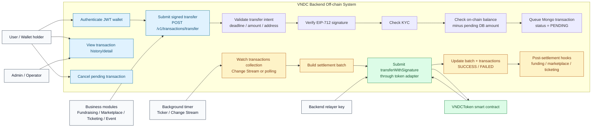
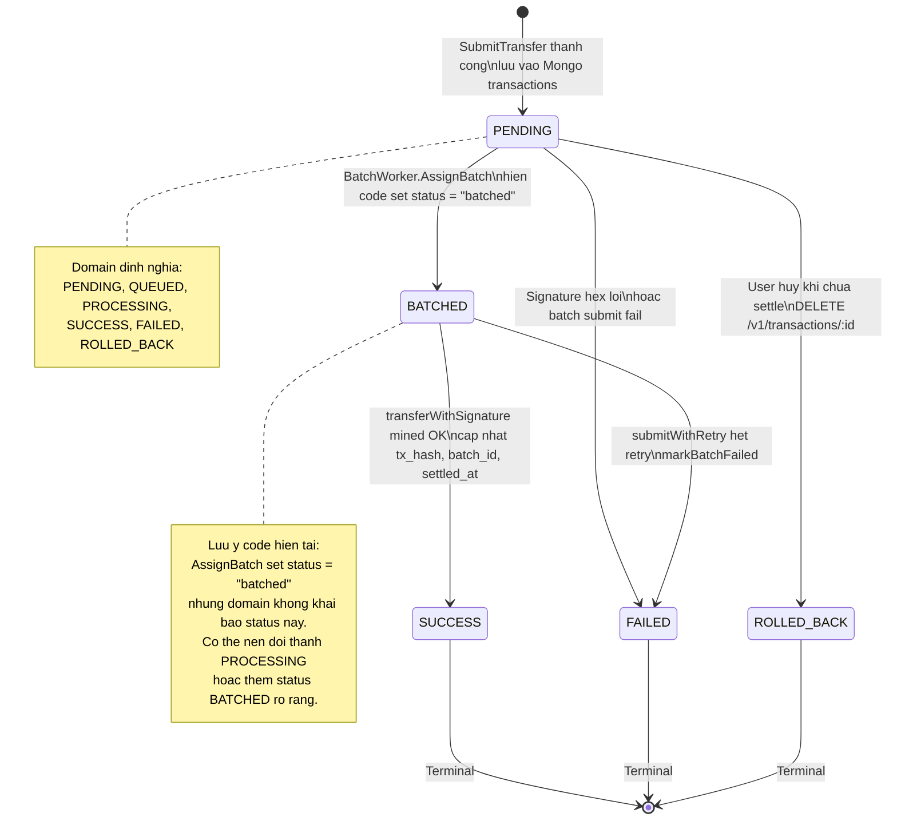
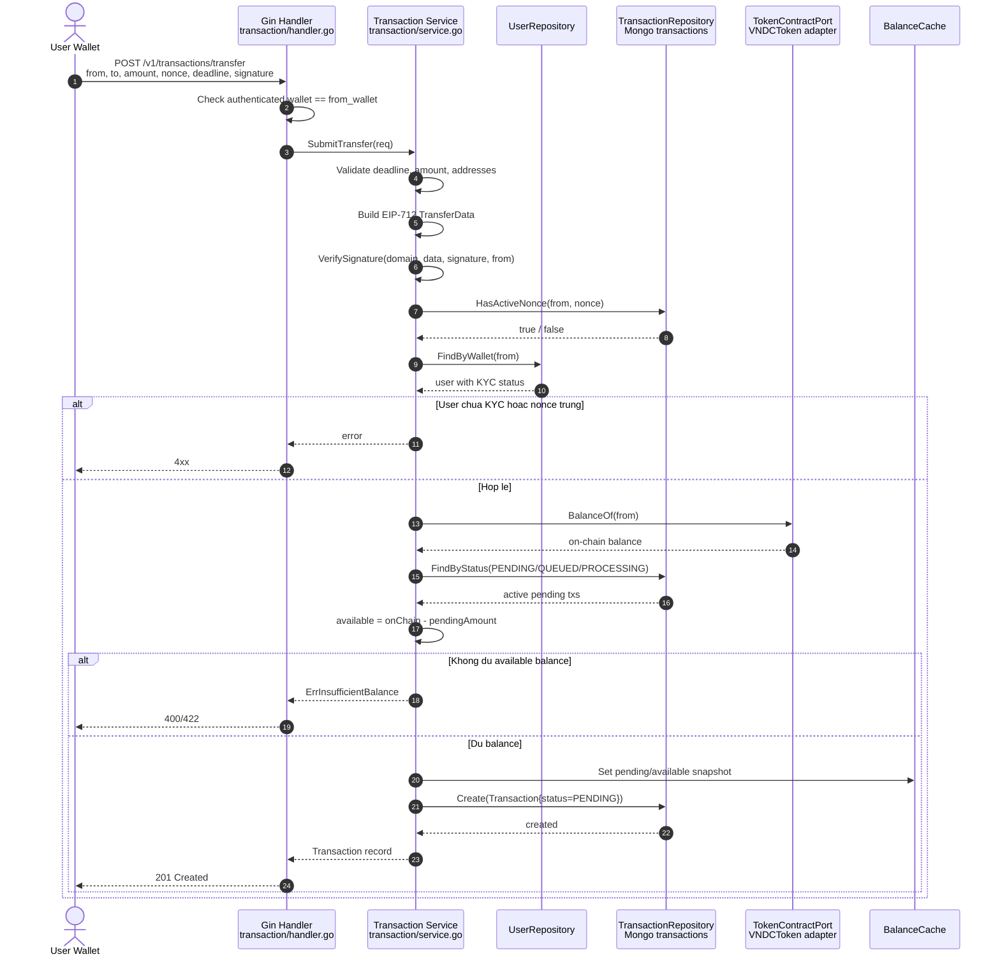
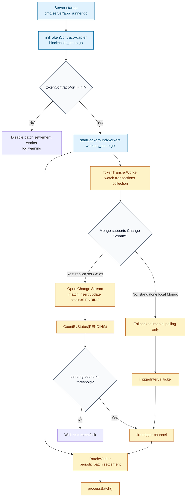
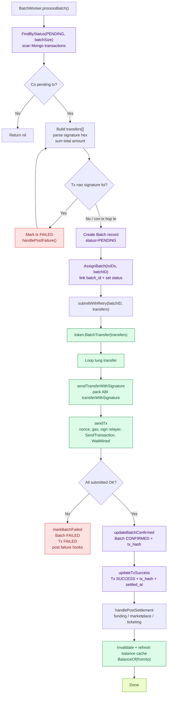
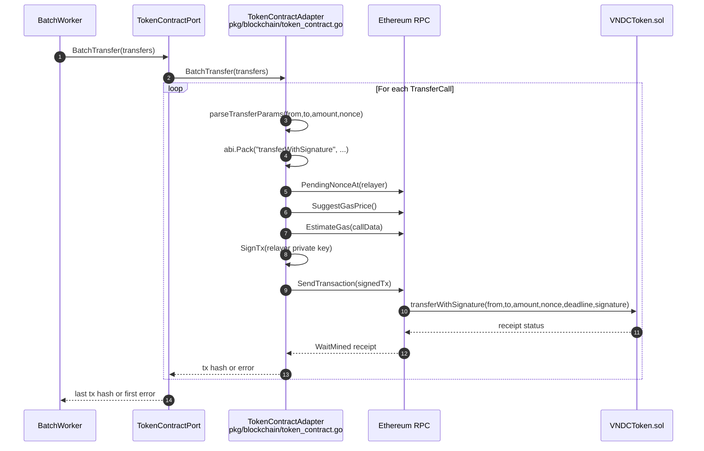
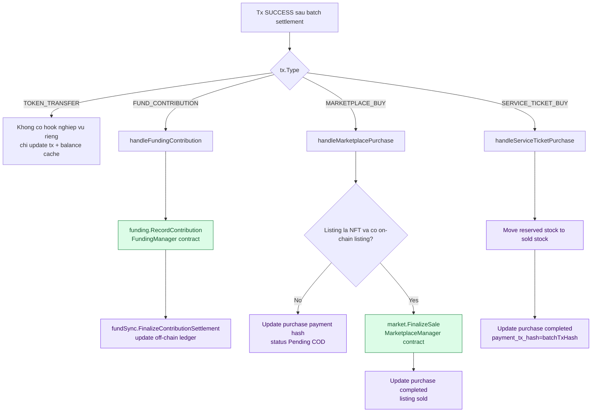
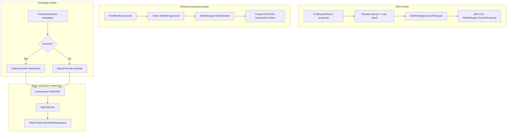
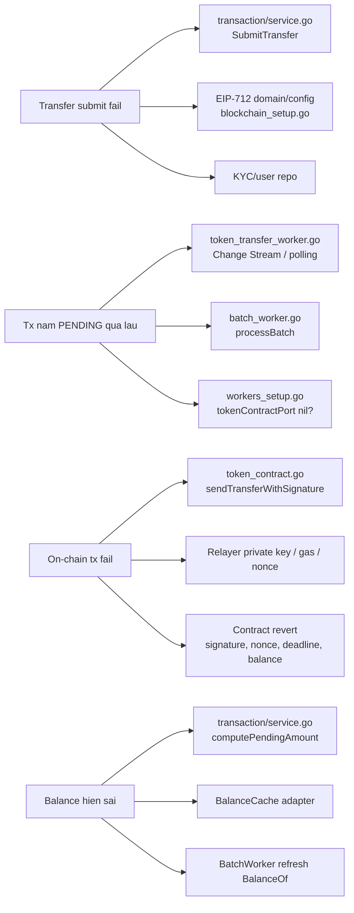

# VNDC Off-chain Transaction Flow

File nay gom cac so do Mermaid de hinh dung luong xu ly transaction trong backend `offchain/backend-go`.

Nguon code chinh:

- API transaction: `internal/application/transaction/handler.go`
- Service transaction: `internal/application/transaction/service.go`
- Domain transaction/batch: `internal/domain/entities.go`
- Mongo repository: `internal/adapters/mongodb/repos.go`
- Worker trigger: `internal/workers/token_transfer_worker.go`
- Worker settlement: `internal/workers/batch_worker.go`
- Smart contract adapter: `pkg/blockchain/token_contract.go`
- Wiring startup: `cmd/server/app_runner.go`, `cmd/server/workers_setup.go`, `cmd/server/blockchain_setup.go`

## 1. Use Case Tong Quan

Chu thich:

- User path truc tiep bat dau tu `POST /v1/transactions/transfer`.
- Business modules cung co the tao transaction bang cach goi `transaction.Service.SubmitTransfer`.
- API chi tao record `PENDING`; viec len chain do worker xu ly bat dong bo.
- Relayer key nam trong backend ky gas transaction khi goi smart contract.

## 2. State Diagram Transaction

Chu thich:

- `PENDING`: transaction da qua validate va dang cho worker settle.
- `BATCHED`: trang thai thuc te do repository ghi vao DB hien tai la lowercase `"batched"`.
- `SUCCESS`: smart contract call thanh cong va worker da update DB.
- `FAILED`: smart contract revert, send tx fail, het retry, hoac payload loi.
- `ROLLED_BACK`: user cancel truoc khi worker settle.

## 3. Sequence API Submit Transfer

Chu thich:

- Service verify chu ky off-chain truoc khi ghi DB.
- Balance check doc chain bang `BalanceOf`, sau do tru pending dang active trong DB.
- API khong goi `transferWithSignature` truc tiep; no chi queue transaction.

## 4. Logic Que Database Va Trigger Worker

Chu thich:

- `TokenTransferWorker` khong settle transaction. No chi phat tin hieu de `BatchWorker` chay som.
- Neu Mongo khong phai replica set, Change Stream khong dung duoc; worker van chay bang ticker.
- Collection duoc watch trong code la `transactions`.

## 5. Batch Settlement Logic

Chu thich:

- `BatchTransfer` trong adapter hien tai goi tung `transferWithSignature`, khong phai mot Solidity batch function.
- `tx_hash` luu lai la hash cuoi cung ma `BatchTransfer` tra ve.
- Sau settlement thanh cong, worker goi cac hook nghiep vu theo `tx.Type`.

## 6. Smart Contract Interaction Detail

Chu thich:

- User ky EIP-712 signature cho payload transfer.
- Backend relayer ky Ethereum transaction de tra gas.
- Contract verify signature/nonce/deadline o on-chain layer.
- Adapter wait mined, neu receipt failed thi tra loi ve worker.

## 7. Post-settlement Business Hooks

Chu thich:

- Cung mot pipeline transaction co the phuc vu chuyen token thuong, dong gop fund, mua marketplace, mua ticket.
- `ContextType`, `ContextID`, `ContextRef` trong transaction giup worker biet can update entity nghiep vu nao.

## 8. Cac Worker Khac Co Que Database Va Goi Contract

Chu thich:

- Transaction settlement chinh: `TokenTransferWorker` + `BatchWorker`.
- DAO worker doc proposal/vote DB va goi DAO smart contract.
- Reward worker doc reward pending DB va goi TaskManager contract truc tiep, sau do tao transaction history status `SUCCESS`.
- Campaign worker khong goi contract truc tiep; no tao transaction moi qua `SubmitTransfer`, roi pipeline chinh settle sau.

## 9. Noi Nen Bat Dau Khi Debug

